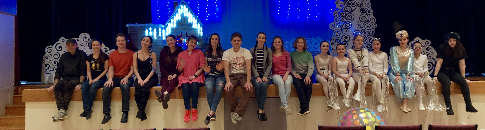
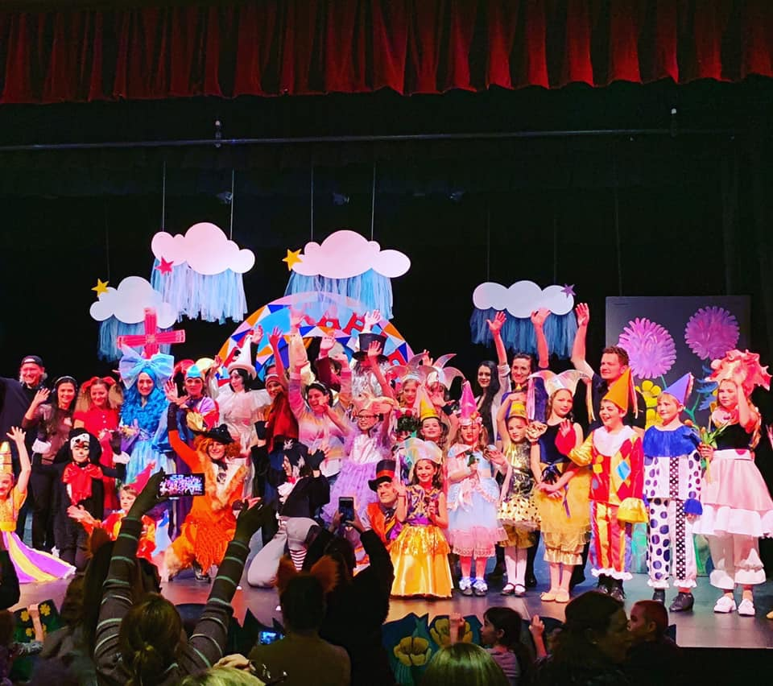
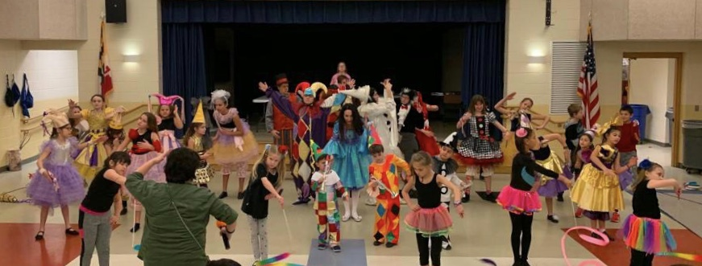
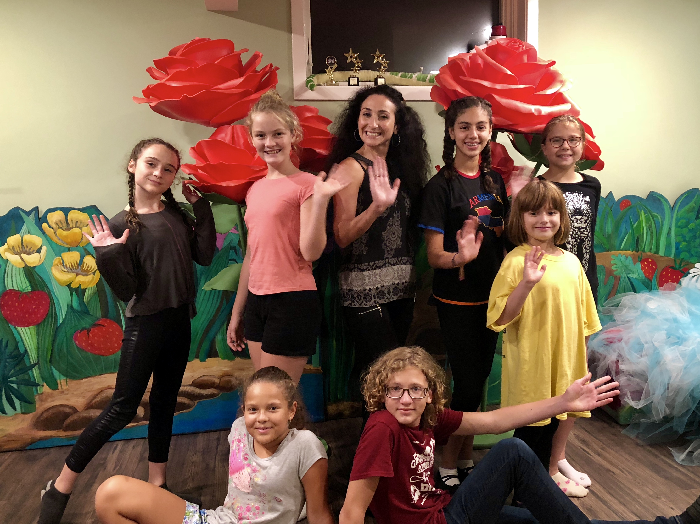

Мы работаем с детьми, для которых русский язык не является основным. Цель работы – вызвать интерес к изучению языка, познакомить с увлекательным миром русской литературы, сказок, поэзии и фольклора.

Самая эффективная форма интеграции детей в русскую культуры – это, конечно, детский театр. Здесь можно встретиться с настоящими героями сказок, поиграть с ними, понять кто добрый, а кто злой, окунуться в мир русской литературы, музыки, речи.

Актером детского театра-студии может стать любой творческий человек. В нашем дружном коллективе есть участники всех возрастов от 5 до 50 лет. Театр объединил людей из России, Украины, Узбекистана, Белоруссии, Армении, США.

